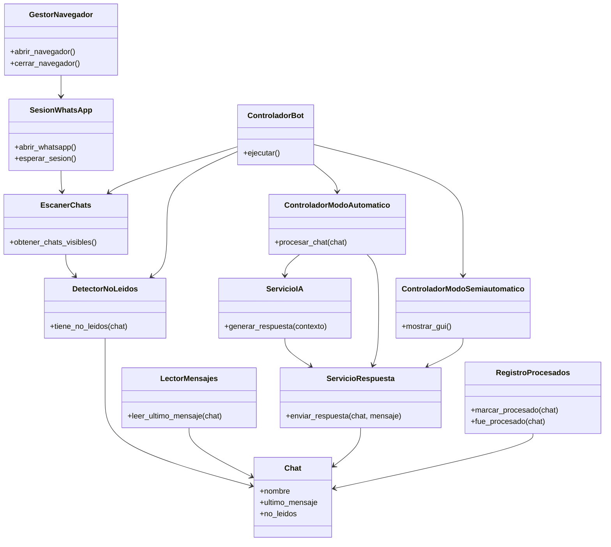

Perfecto. Si quieres llevar el proyecto con una arquitectura profesional **en español**, coherente con MVC + POO, aquí tienes el diseño completo traducido y adaptado para que tu proyecto quede limpio, mantenible y escalable.

---

# Estructura de Carpetas en Español

```text id="0o6x1w"
bot_whatsapp/
│
├── principal.py
│
├── configuracion/
│   ├── ajustes.py
│   └── selectores.py
│
├── nucleo/
│   ├── gestor_navegador.py
│   ├── sesion_whatsapp.py
│   └── controlador_bucle.py
│
├── modelos/
│   ├── chat.py
│   ├── mensaje.py
│   └── modo_respuesta.py
│
├── servicios/
│   ├── escaner_chats.py
│   ├── detector_no_leidos.py
│   ├── lector_mensajes.py
│   ├── servicio_respuesta.py
│   ├── servicio_ia.py
│   └── registro_procesados.py
│
├── controladores/
│   ├── controlador_bot.py
│   ├── controlador_modo_automatico.py
│   └── controlador_modo_semiautomatico.py
│
├── vistas/
│   ├── interfaz_principal.py
│   ├── panel_chats_pendientes.py
│   └── editor_respuesta.py
│
├── utilidades/
│   ├── logger.py
│   ├── esperas.py
│   └── validadores.py
│
└── datos/
    ├── chats_procesados.json
    └── configuracion_usuario.json
```

---

# Diagrama de Clases UML (Mermaid)

````markdown id="2qv7uo"

````

---

# Responsabilidad de Cada Clase

---

## GestorNavegador

Maneja Brave/SeleniumBase.

```text id="ujx5ry"
- Abrir navegador
- Configurar perfil
- Reiniciar navegador
```

---

## SesionWhatsApp

Control de autenticación.

```text id="jdu9go"
- Abrir WhatsApp Web
- Esperar login QR
- Validar sesión activa
```

---

## EscanerChats

```text id="6jx4vf"
- Obtener chats visibles
- Scroll lista chats
```

---

## DetectorNoLeidos

```text id="e53ckj"
- Detectar badge unread
- Contar mensajes nuevos
```

---

## LectorMensajes

```text id="y5v5py"
- Leer último mensaje
- Obtener contexto conversación
```

---

## ServicioRespuesta

```text id="2qjlwm"
- Escribir mensaje
- Enviar mensaje
```

---

## ServicioIA

```text id="bn0zmn"
- Analizar contexto
- Generar respuesta automática
```

---

## RegistroProcesados

```text id="7mldqv"
- Evitar doble respuesta
- Persistir historial
```

---

## ControladorBot

```text id="e7tw17"
- Loop principal
- Orquestación general
```

---

# Flujo Arquitectónico Final

```text id="5r9p5d"
Principal
   │
   ▼
ControladorBot
   │
   ▼
EscanerChats
   │
   ▼
DetectorNoLeidos
   │
   ▼
Modo Automatico / Semiautomatico
   │
   ▼
Servicio IA / Servicio Respuesta
```

---

# Recomendación Profesional

Con este diseño podrás agregar fácilmente después:

```text id="4h5rls"
✓ Múltiples modelos de IA
✓ Plantillas de respuesta
✓ Reglas de negocio por contacto
✓ Integración con CRM
✓ Dashboard de métricas
✓ Logs empresariales
```

---

# Commit Profesional sugerido

```text id="g1vg3a"
docs: define arquitectura MVC y diagrama de clases inicial del bot de WhatsApp en español
```

---

Si quieres, te genero el **código base inicial de cada archivo/clase** para que arranques el proyecto ya estructurado.
