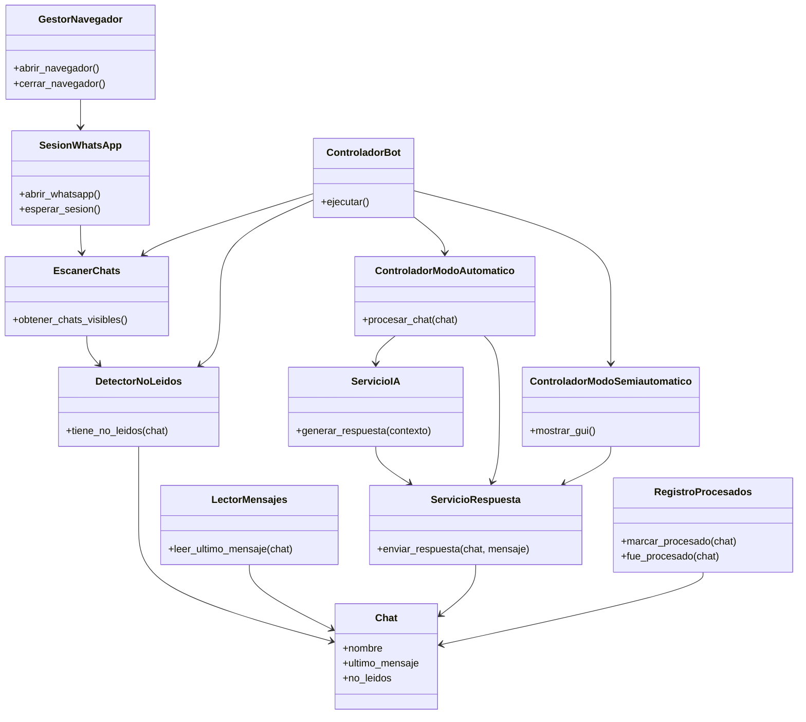

```mermaid
classDiagram

class GestorNavegador {
    +abrir_navegador()
    +cerrar_navegador()
}

class SesionWhatsApp {
    +abrir_whatsapp()
    +esperar_sesion()
}

class EscanerChats {
    +obtener_chats_visibles()
}

class DetectorNoLeidos {
    +tiene_no_leidos(chat)
}

class LectorMensajes {
    +leer_ultimo_mensaje(chat)
}

class ServicioRespuesta {
    +enviar_respuesta(chat, mensaje)
}

class ServicioIA {
    +generar_respuesta(contexto)
}

class RegistroProcesados {
    +marcar_procesado(chat)
    +fue_procesado(chat)
}

class ControladorBot {
    +ejecutar()
}

class ControladorModoAutomatico {
    +procesar_chat(chat)
}

class ControladorModoSemiautomatico {
    +mostrar_gui()
}

class Chat {
    +nombre
    +ultimo_mensaje
    +no_leidos
}

GestorNavegador --> SesionWhatsApp
SesionWhatsApp --> EscanerChats
EscanerChats --> DetectorNoLeidos
DetectorNoLeidos --> Chat
LectorMensajes --> Chat
ServicioRespuesta --> Chat
ServicioIA --> ServicioRespuesta
RegistroProcesados --> Chat

ControladorBot --> EscanerChats
ControladorBot --> DetectorNoLeidos
ControladorBot --> ControladorModoAutomatico
ControladorBot --> ControladorModoSemiautomatico

ControladorModoAutomatico --> ServicioIA
ControladorModoAutomatico --> ServicioRespuesta

ControladorModoSemiautomatico --> ServicioRespuesta
```