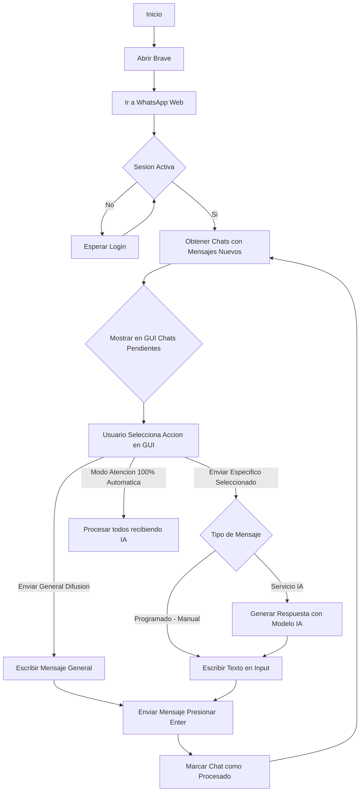

```mermaid
flowchart TD

A[Inicio] --> B[Abrir Brave]
B --> C[Ir a WhatsApp Web]
C --> D{Sesion Activa}

D -- No --> E[Esperar Login]
E --> D

D -- Si --> F[Obtener Chats con Mensajes Nuevos]

F --> G{Mostrar en GUI Chats Pendientes}
G --> H[Usuario Selecciona Accion en GUI]

H -->|Enviar General Difusion| I[Escribir Mensaje General]
H -->|Enviar Especifico Seleccionado| J{Tipo de Mensaje}

J -->|Programado - Manual| K[Escribir Texto en Input]
J -->|Servicio IA| L[Generar Respuesta con Modelo IA]

L --> K
I --> M[Enviar Mensaje Presionar Enter]
K --> M

M --> N[Marcar Chat como Procesado]
N --> F

%% FUTURO
H -->|Modo Atencion 100% Automatica| O[Procesar todos recibiendo IA]
```