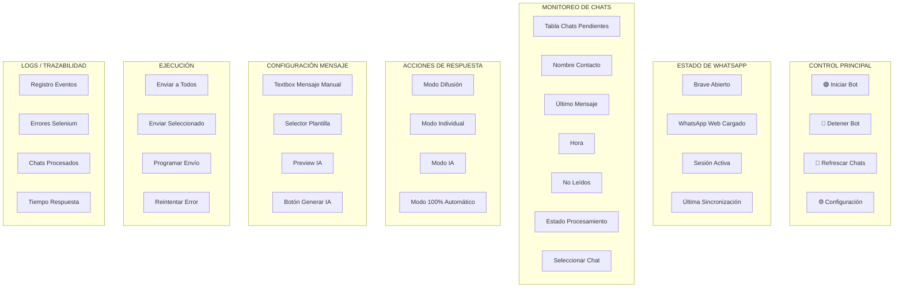
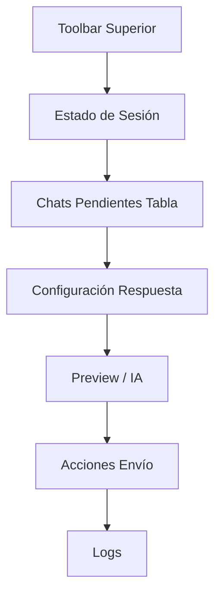
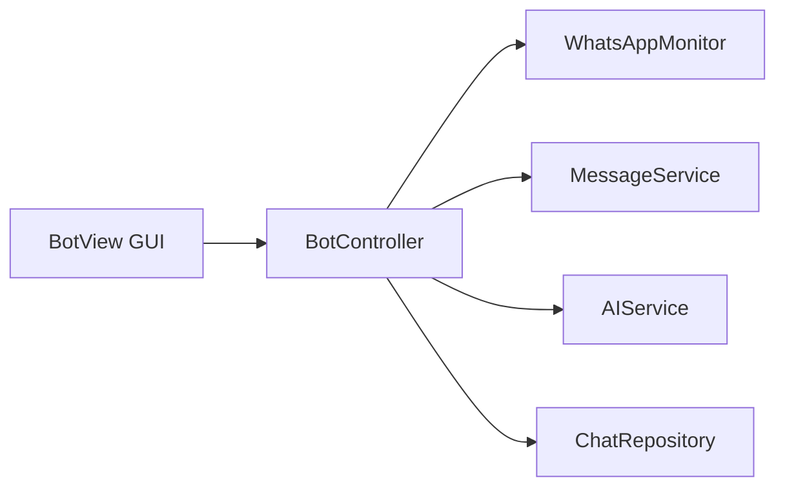

Perfecto. Tu UI actual funciona, pero para una arquitectura MVC avanzada como la de tu flujo, **le falta granularidad operacional y visualización del estado por cada etapa del bot**.
Lo ideal es rediseñarla como una interfaz de **centro de control profesional**, donde cada bloque represente una fase exacta de tu diagrama.

---

# Propuesta de UI Profesional Basada en tu Flujo (Diagramada)



---

# Distribución Recomendada de Campos (Muy Específica)

---

## 1. PANEL SUPERIOR — CONTROL DEL BOT

| Campo           | Tipo  | Función               |
| --------------- | ----- | --------------------- |
| Iniciar Bot     | Botón | Inicia Selenium/Brave |
| Detener Bot     | Botón | Mata proceso / loop   |
| Refrescar Chats | Botón | Relee WhatsApp        |
| Configuración   | Botón | Abre modal settings   |

---

## 2. PANEL ESTADO DE SESIÓN

Representa:

```mermaid
D --> F
```

| Campo         | Tipo  | Resultado Esperado |
| ------------- | ----- | ------------------ |
| Brave Status  | Badge | Abierto / Cerrado  |
| WhatsApp Web  | Badge | Cargando / Listo   |
| Login Status  | Badge | QR / Activa        |
| Última Sync   | Label | Timestamp          |
| Tiempo Activo | Label | Cronómetro         |

---

## 3. TABLA DE CHATS PENDIENTES (CORE)

Representa:

```mermaid
F --> G
```

### Debe ser una tabla real, no textbox:

| ✔ | Contacto  | Último Mensaje | Hora    | No Leídos | Prioridad | Estado    |
| - | --------- | -------------- | ------- | --------- | --------- | --------- |
| ☐ | Juan      | "Hola bro"     | 2:31 PM | 3         | Alta      | Pendiente |
| ☐ | Empresa X | "Cotización?"  | 2:28 PM | 1         | Media     | IA Lista  |

---

## 4. PANEL DE CONFIGURACIÓN DE RESPUESTA

Representa:

```mermaid
J --> K / L
```

| Campo            | Tipo     | Función          |
| ---------------- | -------- | ---------------- |
| Radio Manual     | Toggle   | Mensaje manual   |
| Radio IA         | Toggle   | IA responde      |
| Radio Plantilla  | Toggle   | Usa template     |
| Combo Plantillas | Dropdown | Selección rápida |
| Textbox Manual   | Input    | Mensaje editable |
| Preview IA       | TextArea | Vista previa IA  |

---

## 5. PANEL DE EJECUCIÓN

Representa:

```mermaid
M --> N
```

| Campo               | Tipo          | Función            |
| ------------------- | ------------- | ------------------ |
| Enviar a Todos      | Botón Azul    | Difusión masiva    |
| Enviar Seleccionado | Botón Naranja | Solo seleccionados |
| Programar Envío     | Botón         | Delay / Scheduler  |
| Reintentar Fallidos | Botón         | Retry errores      |

---

## 6. PANEL DE AUTOMATIZACIÓN AVANZADA

Representa:

```mermaid
H --> O
```

| Campo                | Tipo     | Función             |
| -------------------- | -------- | ------------------- |
| Auto IA ON/OFF       | Switch   | Responde automático |
| Delay Random         | Input    | Anti-ban            |
| Máx Respuestas/min   | Input    | Rate limit          |
| Ignorar Grupos       | Checkbox | Filtrado            |
| Responder Solo 1 Vez | Checkbox | Anti spam           |

---

## 7. LOGS / AUDITORÍA

| Timestamp | Evento                 | Resultado |
| --------- | ---------------------- | --------- |
| 14:22:01  | Chat Detectado: Juan   | OK        |
| 14:22:05  | IA Generó Respuesta    | OK        |
| 14:22:06  | Mensaje Enviado        | OK        |
| 14:22:08  | Chat Marcado Procesado | OK        |

---

# Wireframe Visual Recomendado



---

# Arquitectura MVC Recomendada para tu UI



---

# Recomendación UX Profesional

### Usa Colores Semánticos:

| Estado      | Color    |
| ----------- | -------- |
| Activo      | Verde    |
| Pendiente   | Amarillo |
| Error       | Rojo     |
| IA Generada | Azul     |
| Procesado   | Gris     |

---

# Si Quieres una UI de Nivel Profesional

Te recomiendo migrarla a:

### Mejor opción Desktop Python:

* **PySide6 / Qt Designer**
* Muchísimo mejor que Tkinter
* Tablas avanzadas
* Badges
* Progress bars
* Layouts profesionales

---

# Resultado Final Esperado

Tu software pasaría de:

> "Script con botones"

a

> **Panel de Control Empresarial de Automatización WhatsApp**

---

Si quieres, en el siguiente mensaje te diseño el **mockup visual completo estilo Figma/empresa SaaS** (en imagen/diagrama detallado) o te doy el código base en **PySide6 MVC** para construir esta UI profesional.
